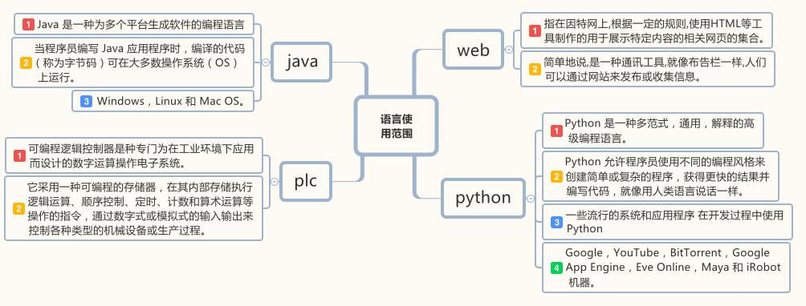

<!--
Author: W3layouts
Author URL: http://w3layouts.com
License: Creative Commons Attribution 3.0 Unported
License URL: http://creativecommons.org/licenses/by/3.0/
-->
<!DOCTYPE HTML>
<html>
<head>
	<title>XIAOZHIBEI的主页</title>
	<meta name="viewport" content="width=device-width, initial-scale=1">
	<meta http-equiv="Content-Type" content="text/html; charset=utf-8" />
	<meta name="keywords" content="Pooled Responsive web template, Bootstrap Web Templates, Flat Web Templates, Android Compatible web template,
Smartphone Compatible web template, free webdesigns for Nokia, Samsung, LG, SonyEricsson, Motorola web design" />
	
	<!-- Bootstrap Core CSS -->
	<link href="css/bootstrap.min.css" rel='stylesheet' type='text/css' />
	<!-- Custom CSS -->
	<link href="css/style.css" rel='stylesheet' type='text/css' />
	<link rel="stylesheet" href="css/morris.css" type="text/css"/>
	<!-- Graph CSS -->
	<link href="css/font-awesome.css" rel="stylesheet">
	<!-- jQuery -->
	
	<!-- //jQuery -->
	<link href='//fonts.googleapis.com/css?family=Roboto:700,500,300,100italic,100,400' rel='stylesheet' type='text/css'/>
	<link href='//fonts.googleapis.com/css?family=Montserrat:400,700' rel='stylesheet' type='text/css'>
	<!-- lined-icons -->
	<link rel="stylesheet" href="css/icon-font.min.css" type='text/css' />
	<link rel="stylesheet" href="mycss/mycss.css" type='text/css' />
	<!-- //lined-icons -->
</head>
<body>

	<!--/content-inner-->
	

		

			<!--header start here-->
			<!--heder end here-->
			<ol class="breadcrumb">
				<li class="breadcrumb-item"><a href="index.html">主页</a> <i class="fa fa-angle-right"></i></li>
			</ol>
			<!--four-grids here-->
			

				

					

						

							<i class="glyphicon glyphicon-folder-open" aria-hidden="true"></i>
						

						

							<h3>web</h3>
						

					

				

				

					

						

							<i class="glyphicon glyphicon-folder-open" aria-hidden="true"></i>
						

						

							<h3>python</h3>
						

					

				

				

					

						

							<i class="glyphicon glyphicon-folder-open" aria-hidden="true"></i>
						

						

							<h3>java</h3>
						

					

				

				

					

						

							<i class="glyphicon glyphicon-folder-open" aria-hidden="true"></i>
						

						

							<h3>plc</h3>
						

					

				

				

			

			<!--//four-grids here-->
			<!--agileinfo-grap-->
			

				
			

			<!--//agileinfo-grap-->
			<!--photoday-section-->
			

			<!--//photoday-section-->
			<!--w3-agileits-pane-->
			<!--//w3-agileits-pane-->
			<!-- script-for sticky-nav -->
			<!-- /script-for sticky-nav -->
			<!--inner block start here-->
			<!--inner block end here-->
			<!--copy rights start here-->
			

				
2020年4月30日 

			

			<!--COPY rights end here-->
		

	

	<!--//content-inner-->
	<!--/sidebar-menu-->
	

		<header class="logo1">
			<a href="#" class="sidebar-icon">  </a>
		</header>
		

		

			<ul id="menu" >
				<li><a href="index.html"><i class="fa fa-tachometer"></i> 主页面

</a></li>

				<li id="menu-academico1" ><a href="inbox.html"><i class="fa fa-envelope nav_icon"></i>信息盒

</a></li>
				<li><a href="gallery.html"><i class="fa fa-picture-o" aria-hidden="true"></i>画簿

</a></li>
				<li id="menu-academico2" ><a href="charts.html"><i class="fa fa-bar-chart"></i>列表

</a></li>
				<li id="menu-academico3" ><a href="#"><i class="fa fa-list-ul" aria-hidden="true"></i>短代码 

</a>
					<ul id="menu-academico-sub4" >
						<li id="menu-academico-avaliacoes5" ><a href="icons.html">图表</a></li>
						<li id="menu-academico-avaliacoes6" ><a href="typography.html">排版</a></li>
						<li id="menu-academico-avaliacoes7" ><a href="faq.html">问答</a></li>
					</ul>
				</li>
				<li id="menu-academico8" ><a href="errorpage.html"><i class="fa fa-exclamation-triangle" aria-hidden="true"></i>错误页

</a></li>
				<li id="menu-academico9" ><a href="#"><i class="fa fa-cogs" aria-hidden="true"></i> UI元件 

</a>
					<ul id="menu-academico-sub10" >
						<li id="menu-academico-avaliacoes11" ><a href="button.html">按钮</a></li>
						<li id="menu-academico-avaliacoes12" ><a href="grid.html">网格</a></li>
					</ul>
				</li>
				<li><a href="tabels.html"><i class="fa fa-table"></i>  T表簿

</a></li>
				<li><a href="maps.html"><i class="fa fa-map-marker" aria-hidden="true"></i>  地图

</a></li>
				<li id="menu-academico" ><a href="#"><i class="fa fa-file-text-o"></i>  多页 

</a>
					<ul id="menu-academico-sub" >
						<li id="menu-academico-boletim" ><a href="calendar.html">日历</a></li>
						<li id="menu-academico-avaliacoes13" ><a href="signin.html">签入</a></li>
						<li id="menu-academico-avaliacoes14" ><a href="signup.html">签出</a></li>
					</ul>
				</li>
				<li><a href="#"><i class="fa fa-check-square-o nav_icon"></i>形式 

</a>
					<ul>
						<li><a href="input.html">输入</a></li>
						<li><a href="validation.html">核实</a></li>
					</ul>
				</li>
			</ul>
		

	

	

<!--js -->

<!-- Bootstrap Core JavaScript -->

<!-- /Bootstrap Core JavaScript -->
<!-- morris JavaScript -->

</body>
</html>
